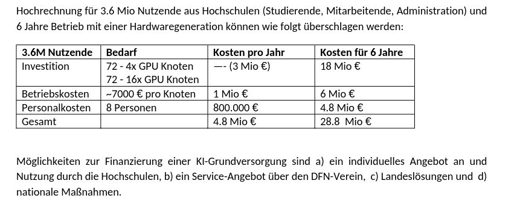
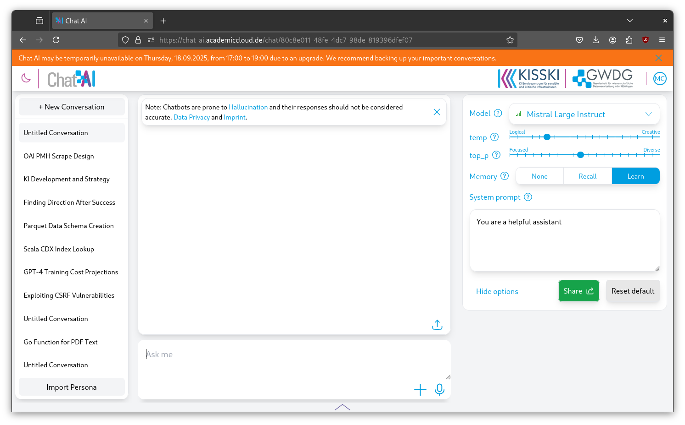
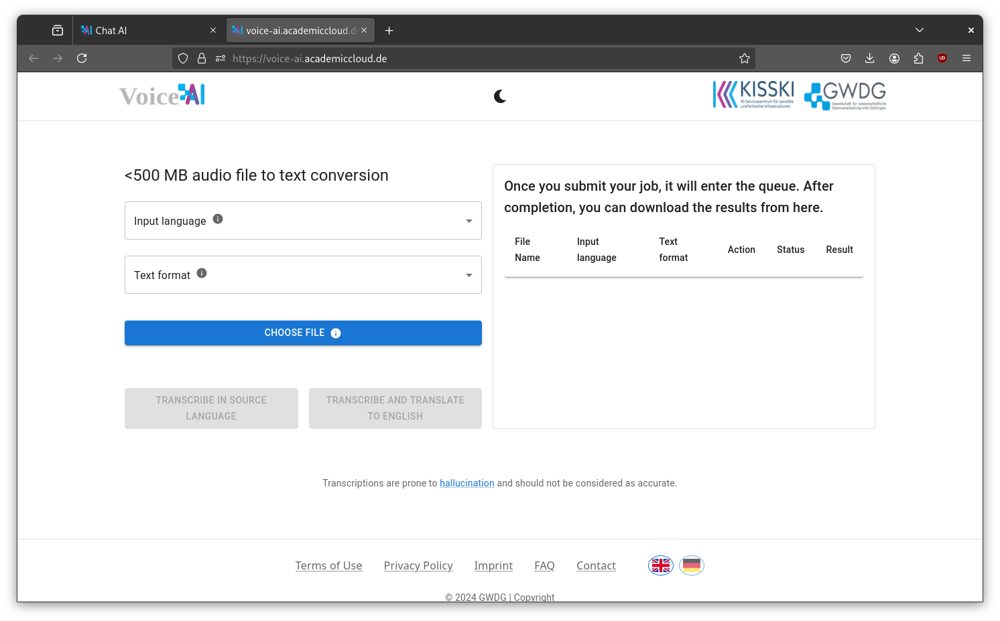
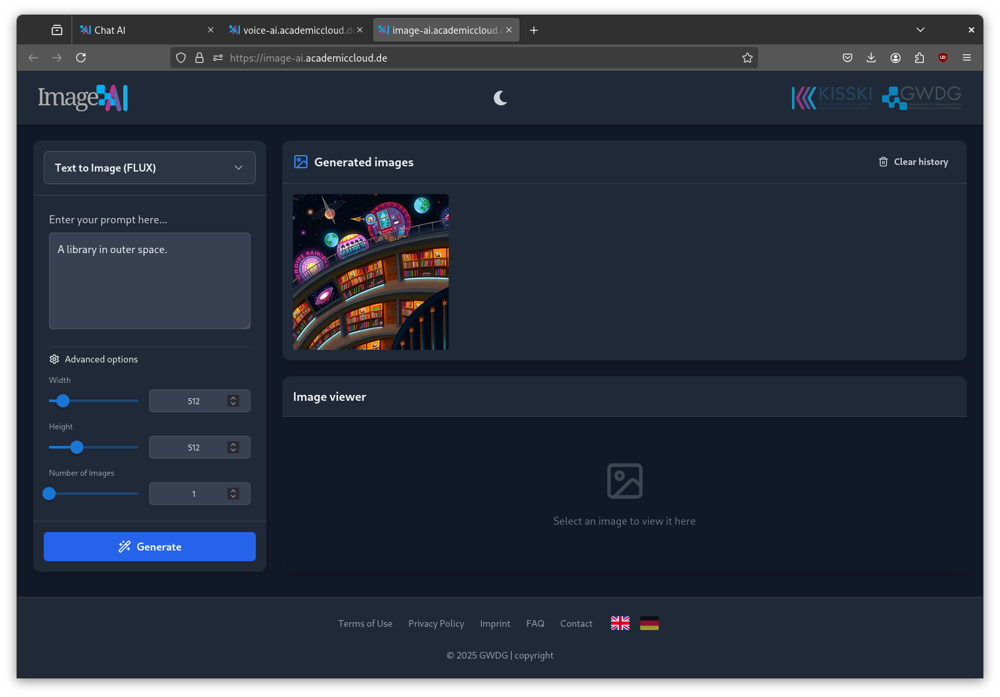
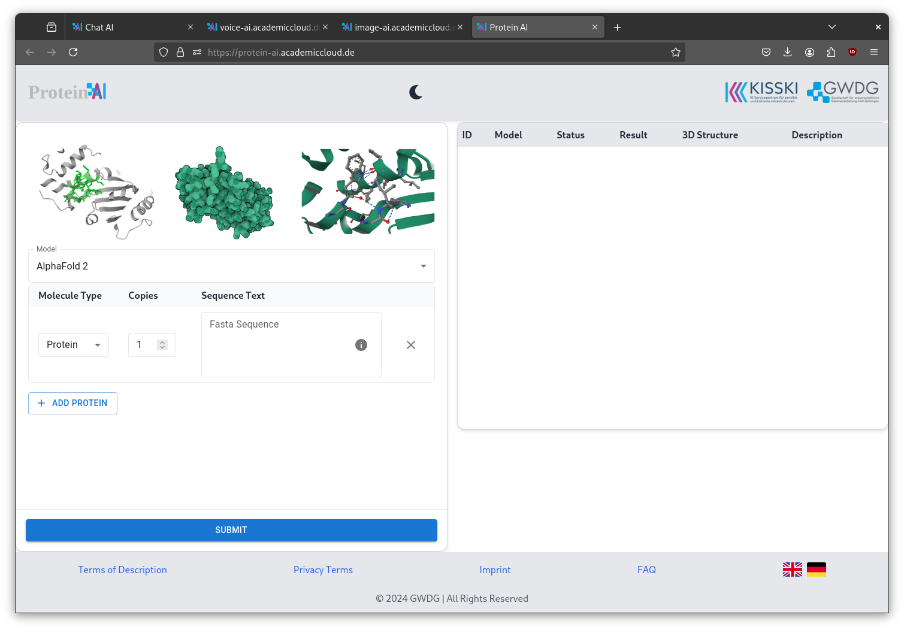

# AI exploration 5

> 2025-09-18, [UB Leipzig](https://www.ub.uni-leipzig.de/)

Previously:

* [aiexp-25-4](https://github.com/miku/aiexp-25-4)
* [aiexp-25-3](https://github.com/miku/aiexp-25-3)
* [aiexp-25-2](https://github.com/miku/aiexp-25-2)
* [aiexp-25-1](https://github.com/miku/aiexp-25-1)

## GWDG KI SEP 2025 Meeting

Background:

* [https://idw-online.de/de/news855838](https://idw-online.de/de/news855838)

Proposal:

* [Konzept für die KI-Grundversorgung](https://kisski.gwdg.de/dok/grundversorgung.pdf)

> Die Versorgungslandschaft mit KI-Lösungen an Deutschen Hochschulen ist > derzeit – wo überhaupt vorhanden - **sehr heterogen**.

> Bei vielen Lösungen besteht das Grundproblem darin, dass **nicht skalierbar
> geplant wird**, sondern von Anfang an die Verwendung durch einen **begrenzten
> Nutzendenkreis** vorgesehen ist.

> Dabei kommt es zwischen verschiedenen Anbietern oft zu **Parallelentwicklungen**,
> welche zur **Verschwendung von Ressourcen** führen und Personal binden, welches
> sonst an der Weiterentwicklung der KI-Technologien im Ganzen arbeiten
> könnten.

> Eine **bundesweite Koordination der KI-Entwicklungen** oder eine Verständigung
> auf wenige, technisch geeignete Versorger, **fehlt** - **wäre aber aus Effizienz-
> und Kostengründen angeraten**.

Was heißt Grundversorgung:

> Grundversorgung bedeutet nicht einfach nur das bloße Vorhandensein von einem
> oder mehreren Werkzeugen, sondern auch die **rechtssichere Bereitstellung** und
> **elementare Unterstützung und Training der Anwender** mit diesen Werkzeugen.
> Aufbauend auf einer Grundversorgung ist ein **Community-basiertes Ökosystem
> angedockt**, dass Nutzenden ermöglicht KI effektiv und verantwortungsvoll für
> viele weitere Anwendungsszenarien bequem zu nutzen.

[...]

> Deutschland benötigt eine nicht von kommerziellen Interessen getriebene
> KI-Lösung, die Grundversorgung für Hochschulen und Bildung bietet sowie
> weitere Entwicklungen und Beiträge zu einem **offenen Ökosystem** leisten kann.
> **Die langfristige Perspektive der KI-Grundversorgung in Deutschland ist nicht
> mit gewinnorientierten Firmen umsetzbar**.

Ökosystem:

* [...] So kann **Chat AI bereits in bestehende Hochschulwerkzeuge wie Moodle und
  StudIP integriert werden**

Training:

> Dieses **Basistraining** umfasst die Befähigung der Nutzenden zu verstehen wie KI
> funktioniert, das richtige Werkzeug für ihre Zwecke auszuwählen und das
> Werkzeug einzusetzen um ihre Aufgaben vollständig umzusetzen. Im Gegenzug
> sehen wir **weitere Weiterbildungsangebote im KI-Ökosystem im Bereich der
> Anwendungsentwicklung, Bereitstellung, oder Forschung**.

Services:

* [https://chat-ai.academiccloud.de/](https://chat-ai.academiccloud.de/)
* [https://docs.hpc.gwdg.de/services/arcana/index.html](https://docs.hpc.gwdg.de/services/arcana/index.html)
* [https://voice-ai.academiccloud.de/](https://voice-ai.academiccloud.de/)
* [https://image-ai.academiccloud.de/](https://image-ai.academiccloud.de/)
* [https://protein-ai.academiccloud.de/](https://protein-ai.academiccloud.de/)
* [https://docs.hpc.gwdg.de/services/coco/index.html](https://docs.hpc.gwdg.de/services/coco/index.html)

Stats:

>  Für die zeitnahe Abarbeitung von LLM-Anfragen benötigen wir aktuell pro 50.000 Nutzenden

* 4 kleine, leistungsschwache Inferenzmodelle, bspw. 8B auf 1 GPU
* 2 großes, leistungsstarkes Inferenzmodell, bspw. 80B auf 8 GPUs

Investition:

### Screenies

## Outlook

* Individual collaboration and documentation of efforts
* Visiting meetings
* Development and prototypes

